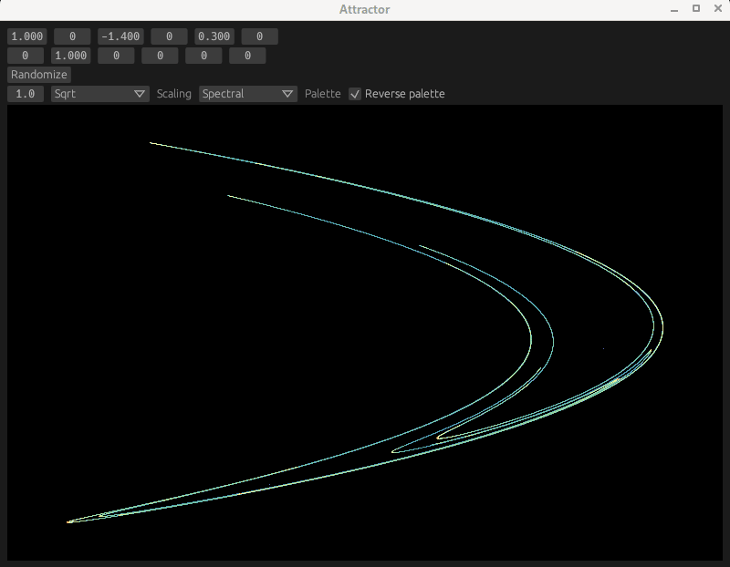

# Attractor

Attractor is a program to search for and generate two dimensional quadratic map strange
attractors.

Status: experimental, for me as an exercise in Rust.

The user can:

* Generate random chaotic attractors
* Tweak the parameters for an attractor
* Tweak image rendering settings, including:
  * Transformations, e.g. linear, square root, log densities
  * Palettes  

# Concepts

Several layers exist before an image is visible on screen:

* Point - a point in attractor space
* Swarm - a set of points in attractor space, generated with a number of iterations and
  quadratic map parameters
* Raster - a matrix of relative densities 0..=1, generated from a swarm and a desired resolution
* Image - a width x height image, generated from a raster and a number of aesthetic settings

# Dependencies

The GUI is built with egui.
Images are generated with image.

# Non-goals

* Attractors other than two dimensional quadratic maps
* Good UX
* Long term maintanence
